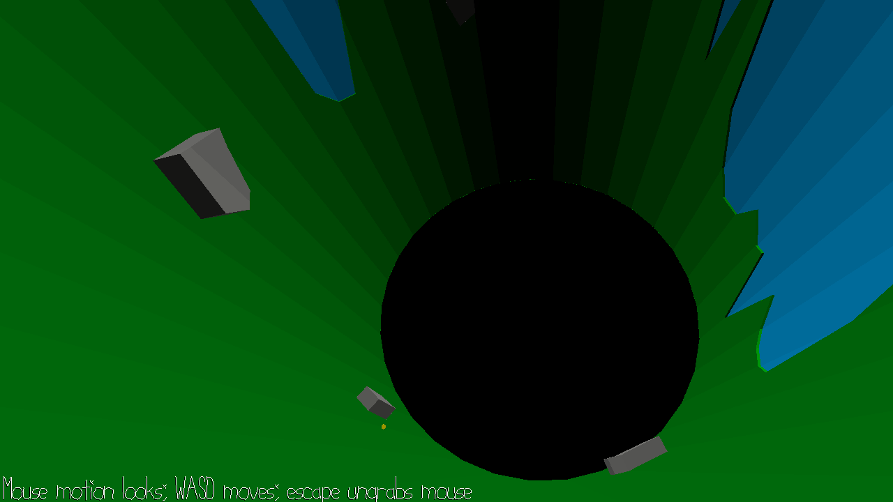

# Cylindrical Terrain

Author: Jesse Liu

Design: A walking simulator inside a cylindrical walkmesh. There's some basic terrain inside the cylinder (more interesting terrain like plants proved too time-consuming to pull off), and there are three coins to collect, after which you win the game.

Screen Shot:

How To Play:

Click to lock the mouse into the game. WASD to move around. ESC to unlock the mouse again. You pretty much just walk around, although there are three coins you can collect if you want to win.

Sources: Sound assets were created on https://jfxr.frozenfractal.com/.

This game was built with [NEST](NEST.md).

